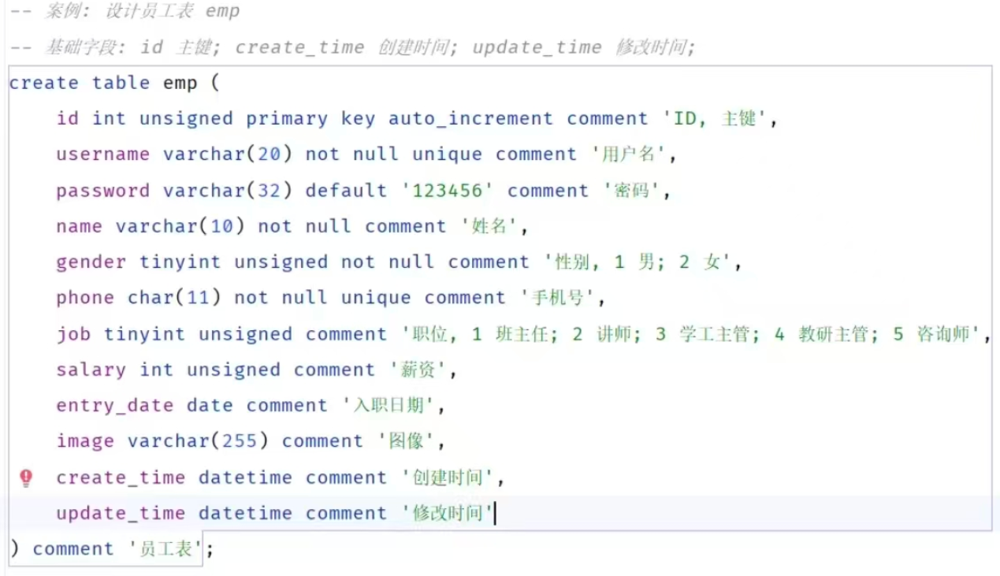

# 数据库常用命令

<p> 
  
## DDL（数据定义语言，用来定义数据库对象（数据库，表，字段））
### 数据库
#### --1.查询所有数据库
```jsx title="src/components/HelloDocusaurus.js"
show databases;
```
#### --2.查询当前数据库
```jsx title="src/components/HelloDocusaurus.js"
select database;
```
#### --3.使用/切换数据库
```jsx title="src/components/HelloDocusaurus.js"
use 数据库名;
```
#### --4.创建数据库
```jsx title="src/components/HelloDocusaurus.js"
create database [if not exists] 数据库名 [default charest utf8mb4];
```
#### --5.删除数据库
```jsx title="src/components/HelloDocusaurus.js"
drop database [if exist] 数据库名;
```

### 表
#### --1.创建表
```jsx title="src/components/HelloDocusaurus.js"
create table tablename(
   字段1 字段类型 [约束] [comment 字段1的注解]
   字段2 字段类型 [约束] [comment 字段2的注解]
   ......
)[comment 表注解]
```
 

 #### --2.查询表
1）查询当前数据库所有表
 ```jsx title="src/components/HelloDocusaurus.js"
show tables;
```
2）查询表结构
  ```jsx title="src/components/HelloDocusaurus.js"
desc 表名;
```
3）查询建表语句
 ```jsx title="src/components/HelloDocusaurus.js"
show create table 表名;
```
#### --3.修改表
1）添加字段
 ```jsx title="src/components/HelloDocusaurus.js"
alter table 表名 add 字段 数据类型（长度） [comment 注解] [约束];
```
2）修改字段类型
 ```jsx title="src/components/HelloDocusaurus.js"
alter table 表名 modify 字段名 新数据类型（长度）;
```
3）修改字段名
 ```jsx title="src/components/HelloDocusaurus.js"
alter table 表名 change 旧字段 新字段 数据类型（长度） [comment 注解] [约束];
```
4）删除字段
 ```jsx title="src/components/HelloDocusaurus.js"
alter table 表名 drop colum 字段名;
```
5）修改表名
 ```jsx title="src/components/HelloDocusaurus.js"
alter table 旧表名 rename to 新表名;
```

#### --4.删除表
 ```jsx title="src/components/HelloDocusaurus.js"
drop table [if exists] 表名;
```

<br>

## DML（数据操作语言，用来对数据库表中的数据进行增删改）

<br>

## DQL（数据查询语言，用来查询数据库中的表记录）
